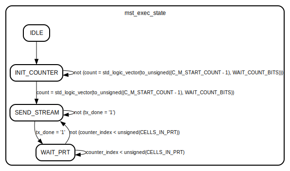

# Entity: LoopCounter_v1_0_M00_AXIS 
- **File**: LoopCounter_v1_0_M00_AXIS.vhd

## Diagram

## Generics

| Generic name         | Type    | Value | Description                                                                                                |
| -------------------- | ------- | ----- | ---------------------------------------------------------------------------------------------------------- |
| CELLS_DATA_WIDTH     | integer | 16    | The maximum number of cells in a transaction is 2^CELLS_DATA_WIDTH                                         |
| C_M_AXIS_TDATA_WIDTH | integer | 32    | Width of S_AXIS address bus. The slave accepts the read and write addresses of width C_M_AXIS_TDATA_WIDTH. |
| C_M_START_COUNT      | integer | 32    | Start count is the number of clock cycles the master will wait before initiating/issuing any transaction.  |

## Ports

| Port name      | Direction | Type                                                    | Description                                                                                                                                         |
| -------------- | --------- | ------------------------------------------------------- | --------------------------------------------------------------------------------------------------------------------------------------------------- |
| ENABLE         | in        | std_logic                                               | Ascynchronous reset signal from the counter configurator                                                                                            |
| CELLS_IN_PRT   | in        | std_logic_vector(CELLS_DATA_WIDTH - 1 downto 0)         | Number of cells in a Pulse Repetition Time (PRT)                                                                                                    |
| CELLS_TO_SEND  | in        | std_logic_vector(CELLS_DATA_WIDTH - 1 downto 0)         | Number of cells to be adquired                                                                                                                      |
| VALID_CONFIG   | out       | std_logic                                               | Validates that CELLS_IN_PRT >= CELLS_TO_SEND                                                                                                        |
| M_AXIS_ACLK    | in        | std_logic                                               |                                                                                                                                                     |
| M_AXIS_ARESETN | in        | std_logic                                               |                                                                                                                                                     |
| M_AXIS_TVALID  | out       | std_logic                                               | Master Stream Ports. TVALID indicates that the master is driving a valid transfer, A transfer takes place when both TVALID and TREADY are asserted. |
| M_AXIS_TDATA   | out       | std_logic_vector(C_M_AXIS_TDATA_WIDTH - 1 downto 0)     | TDATA is the primary payload that is used to provide the data that is passing across the interface from the master.                                 |
| M_AXIS_TSTRB   | out       | std_logic_vector((C_M_AXIS_TDATA_WIDTH/8) - 1 downto 0) | TSTRB is the byte qualifier that indicates whether the content of the associated byte of TDATA is processed as a data byte or a position byte.      |
| M_AXIS_TLAST   | out       | std_logic                                               | TLAST indicates the boundary of a packet.                                                                                                           |
| M_AXIS_TREADY  | in        | std_logic                                               | TREADY indicates that the slave can accept a transfer in the current cycle.                                                                         |

## Signals

| Name                | Type                                                | Description                                                                                                                          |
| ------------------- | --------------------------------------------------- | ------------------------------------------------------------------------------------------------------------------------------------ |
| mst_exec_state      | state                                               | Repetition Time                                                                                                                      |
| counter_index       | unsigned(CELLS_DATA_WIDTH - 1 downto 0)             | Counter index                                                                                                                        |
| transaction_counter | unsigned(C_M_AXIS_TDATA_WIDTH - 1 downto 0)         | transaction counter                                                                                                                  |
| rst                 | std_logic                                           | Reset signal combinig enable and M_AXIS_ARESETN                                                                                      |
| config_validated    | std_logic                                           | Internal signal indicating that CELLS_IN_PRT >= CELLS_TO_SEND                                                                        |
| count               | std_logic_vector(WAIT_COUNT_BITS - 1 downto 0)      | AXI Stream internal signals wait counter. The master waits for the user defined number of clock cycles before initiating a transfer. |
| axis_tvalid         | std_logic                                           | streaming data valid                                                                                                                 |
| axis_tvalid_delay   | std_logic                                           | streaming data valid delayed by one clock cycle                                                                                      |
| axis_tlast          | std_logic                                           | Last of the streaming data                                                                                                           |
| axis_tlast_delay    | std_logic                                           | Last of the streaming data delayed by one clock cycle                                                                                |
| stream_data_out     | std_logic_vector(C_M_AXIS_TDATA_WIDTH - 1 downto 0) | Data from counters to AXIS DATA                                                                                                      |
| tx_done             | std_logic                                           | The master has issued all the streaming data stored in FIFO                                                                          |

## Constants

| Name            | Type    | Value                       | Description                                       |
| --------------- | ------- | --------------------------- | ------------------------------------------------- |
| WAIT_COUNT_BITS | integer | clogb2(C_M_START_COUNT - 1) | WAIT_COUNT_BITS is the width of the wait counter. |

## Types

| Name  | Type                                                                                                                                                      | Description                                                                                                                                                                                                                                                                                                                                                                                                                 |
| ----- | --------------------------------------------------------------------------------------------------------------------------------------------------------- | --------------------------------------------------------------------------------------------------------------------------------------------------------------------------------------------------------------------------------------------------------------------------------------------------------------------------------------------------------------------------------------------------------------------------- |
| state | ( IDLE,  INIT_COUNTER,  SEND_STREAM,  WAIT_PRT ) | Define the states of state machine.         IDLE: This is the initial/idle state.                                          INIT_COUNTER: This state initializes the counter, once the counter reaches C_M_START_COUNT count, the state machine changes state to SEND_STREAM.   SEND_STREAM: In this state the stream data is output through M_AXIS_TDATA.     WAIT_PRT: Wait the number of cycles for completing the Pulse. |

## Functions
- clogb2 (bit_depth : integer) return integer
  -  function called clogb2 that returns an integer which has the    value of the ceiling of the log base 2.                              
## Processes
- FSM: ( M_AXIS_ACLK )
  - **Description**
  Control state machine implementation                                               
- delay: ( M_AXIS_ACLK )
  - **Description**
  Delay the axis_tvalid and axis_tlast signal by one clock cycle                               to match the latency of M_AXIS_TDATA                                                        
- counter: ( M_AXIS_ACLK )
  - **Description**
  Increment counter index
- output: ( M_AXIS_ACLK )
  - **Description**
  Streaming output from the counter                                      

## State machines

- Control state machine implementation
